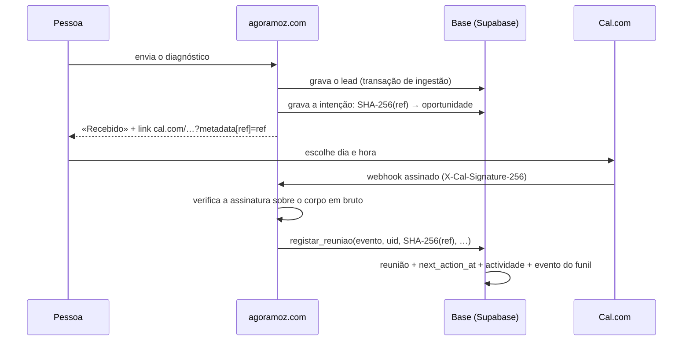

# Agendamento de conversas — Cal.com

No fim do diagnóstico, quem o preencheu pode marcar logo a conversa com a
equipa. A marcação é feita no Cal.com (conta alojada ou instalação própria do
código aberto) e volta ao nosso sistema por webhook: a reunião aparece ligada
à oportunidade, a próxima acção do CRM fica com a data, e o painel conta
marcações, remarcações, cancelamentos e reuniões realizadas.

## Estado

| Peça | Estado |
|---|---|
| Link de marcação no fim do diagnóstico | Pronto, **desligado** (`SCHEDULING=off`) |
| Webhook `POST /api/agendamentos/cal` | Pronto, responde 503 enquanto desligado |
| Migração 0012 (`reunioes`, `reunioes_intencoes`, `registar_reuniao`) | Pronta; **por aplicar** em produção |
| Eventos do Moz News para o painel | No ar (`news_analisada`, `news_falhou`) — não precisam da 0012 |

## Como funciona

- O `ref` é aleatório (24 bytes) e **só existe no link**. A base guarda o hash.
- O link **não leva nada pessoal** — nem nome, nem email. O Cal pede-os ele.
- Do webhook guarda-se **só** uid, início, fim, tipo de evento e o ref. Os
  participantes, as respostas, as notas e o link da videochamada são deitados
  fora antes de chegar à base ou ao log.
- Se a intenção falhar, o diagnóstico **continua aceite**; só falta o link.
- Uma submissão **repetida** recebe um link com a mesma forma, mas o `ref`
  não fica ligado à oportunidade: quem reproduzisse a submissão de outra
  pessoa não consegue escrever reuniões no CRM dela, e a resposta continua
  indistinguível. Essa marcação fica gravada com `ligada: false`.
- A próxima acção da oportunidade passa a ser a reunião futura mais próxima,
  e fica vazia depois de um cancelamento — mas uma data posta à mão pela
  equipa nunca é pisada.
- As intenções expiram em 30 dias e são apagadas automaticamente.
- Se a base falhar no webhook, a rota responde 503 e o Cal volta a enviar.
  A mesma entrega duas vezes não duplica nada, e um estado final (cancelada,
  realizada) não regride com uma entrega atrasada.

## Ligar (passos do responsável pela conta)

1. **Aplicar a migração.** No Supabase (projecto `nixltrbdplqjadfytryd`),
   SQL Editor → correr `supabase/aplicar-0012.sql`. Repetível. Depois correr
   `supabase/verificar-estado.sql`: a linha 22 tem de dizer `ok`.
2. **Escolher o evento no Cal.** O tipo de evento da conversa (duração,
   videochamada — Cal Video ou Google Meet, disponibilidade). O link fica
   `cal.com/<utilizador>/<evento>`.
3. **Gerar o segredo:** `openssl rand -hex 32`.
4. **Criar o webhook no Cal** (Settings → Developer → Webhooks):
   - Subscriber URL: `https://agoramoz.com/api/agendamentos/cal`
   - Eventos: *Booking Created*, *Booking Rescheduled*, *Booking Cancelled*,
     *Meeting Ended*
   - Secret: o segredo do passo 3
5. **Na Vercel** (Production):

   | Variável | Valor |
   |---|---|
   | `SCHEDULING` | `cal` |
   | `CAL_LINK` | `<utilizador>/<evento>` |
   | `CAL_WEBHOOK_SECRET` | o segredo do passo 3 |
   | `CAL_ORIGIN` | só se não for `https://cal.com` |

6. **Novo deploy** (as variáveis só entram num deploy novo).
7. **Marcação de teste** — obrigatória. A documentação do Cal mostra
   `metadata[chave]` a chegar ao webhook no *embed*; aqui usamos o link
   directo. Confirmar no log da Vercel que aparece `agendamento.registado`
   com `ligada: true`. Se aparecer `ligada: false` com `reason: sem-ref`, o
   Cal não passou o ref pelo URL: a reunião fica gravada, mas sem
   oportunidade — avisar para mudarmos para o embed.

Desligar: `SCHEDULING=off` e novo deploy. Nada é apagado.

## Diagnóstico

| Evento de log | Significado |
|---|---|
| `agendamento.registado` (info) | Reunião gravada e ligada à oportunidade; `reason` diz como: `ref`, `anterior` (pela marcação substituída) ou `reuniao` (já conhecida) |
| `agendamento.registado` (warn, `ligada: false`) | Gravada sem oportunidade. `reason: sem-ref` — o link perdeu o ref (ver passo 7); `ref-desconhecido` — ref expirado (30 dias) ou de uma submissão repetida |
| `outcome: sem-mudanca` | Repetição, entrega fora de ordem ou estado final — nada escrito de novo |
| `agendamento.falhou` (error, `reason: forma`) | Entrega **assinada** de um evento subscrito, mas ilegível. Se aparecer em série, o Cal mudou o formato: avisar |
| `agendamento.ignorado` | Evento que não subscrevemos |
| `agendamento.sem_oportunidade` | Diagnóstico aceite sem oportunidade (política do questionário) — sem link |
| `agendamento.falhou` | `desligado`, `config-invalida`, `assinatura` (401), `rate-limit` (429, 120/min por origem), `content-type`, `body-bytes` (413, 64 KB, também sem `Content-Length`), `json`, `base` (503, o Cal reenvia) |
| `agendamento.intencao_falhou` (error) | O diagnóstico foi aceite mas sem link de marcação. Com `errorCode: 42P01`, a 0012 não foi aplicada |

## QA

- `pnpm vitest run lib/agendamento app/api/agendamentos app/api/diagnostico`
- Comportamento da 0012 num Postgres local descartável (nunca produção):
  aplicar as migrações sobre um esboço do Supabase e correr
  `.qa/reunioes-comportamento.sql` — quinze cenários (marcação, repetição,
  remarcação, fim, entrega atrasada, sem ref, ref expirado, entradas
  inválidas, direitos de `anon`/`authenticated` incluindo TRUNCATE,
  `service_role`, remarcação antes da original, cancelamento que limpa a
  próxima acção, data da equipa preservada, uid anterior inválido, limpeza
  das intenções expiradas). O esboço imita os privilégios por omissão do
  Supabase (ALL em tabelas novas), para os `revoke` serem testados a sério.
