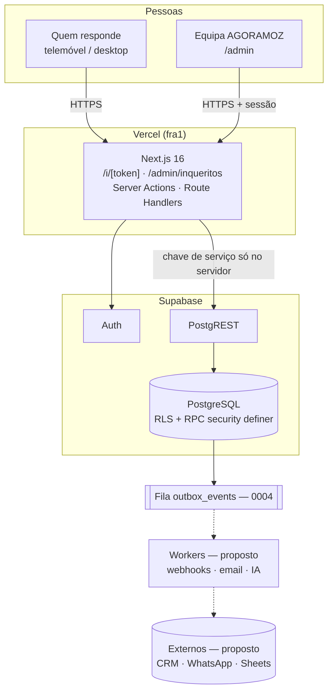
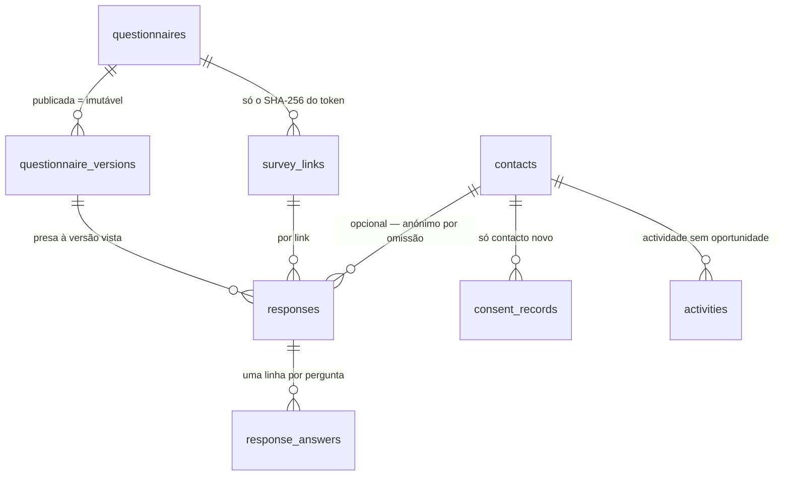

# AGORAFORMS — arquitetura técnica v1 e caminho para a plataforma

> **Decisão:** construir o AGORAFORMS como **monólito modular** sobre a stack
> que já está em produção (Next.js 16 + Supabase/PostgreSQL + Vercel), com
> fronteiras de módulo explícitas, eventos pela fila que já existe (0004) e uma
> API versionada. Microserviços e Kubernetes ficam **desenhados mas não
> construídos**: entram quando os gatilhos da secção 8 forem medidos, não antes.
>
> Classificação: Draft para validação — arquitetura sólida; volumes, custos e
> segmento-alvo ainda por medir. Complementa `docs/INQUERITOS.md` (como
> funciona e como se liga) e `docs/ARQUITETURA.md` (o site no seu todo).

Convenção: **[existe]** = está no código hoje (com ficheiro); **[proposto]** =
desenho, ainda não implementado; **[estimativa]** = número calculado a partir de
premissas declaradas, não medido.

---

## 1. Porque não microserviços já

| Critério | Monólito modular (agora) | Microserviços + K8s (agora) |
|---|---|---|
| Equipa | 1–2 pessoas mantêm tudo | Cada serviço pede dono, pipeline, observabilidade |
| Custo fixo | Planos Vercel + Supabase já em uso | Cluster, registry, ingress, base por serviço — custo antes de haver receita |
| Velocidade | Uma alteração = um commit, um deploy | Contratos entre serviços, versões, deploys coordenados |
| Consistência | Uma transação PostgreSQL (resposta + contacto + evento) | Sagas e consistência eventual desde o dia 1 |
| Risco | Baixo, provado em produção (Lote Q) | Alto: falhas distribuídas sem volume que as justifique |

O que **se faz já** para não fechar a porta: módulos com fronteiras claras
(secção 3), dados de cada módulo nas suas tabelas, comunicação assíncrona pela
outbox (secção 5) e API versionada (secção 6). Extrair um serviço passa a ser
mover um módulo, não reescrever o sistema.

## 2. Visão em camadas (C4, nível contentores)



**[existe]** tudo o que está ligado a traço contínuo. **[proposto]** workers e
conectores.

## 3. Módulos lógicos → serviços futuros

| Módulo | Responsabilidade | Hoje [existe] | Dados que possui | Serviço futuro |
|---|---|---|---|---|
| **Form** | Spec, versões, construtor, validação | `lib/inqueritos/spec.ts`, `construtor.ts`, `components/admin/inqueritos/Construtor.tsx`; RPC `criar_inquerito`, `guardar_rascunho`, `publicar_versao` | `questionnaires`, `questionnaire_versions` | Form Service |
| **Link / Partilha** | Links HMAC, QR, revogação, tectos | `lib/inqueritos/token.ts`, `partilha.ts`, `qr.ts`, `links.ts`; RPC `criar_link`, `revogar_link` | `survey_links` | (no Form Service) |
| **Response** | Ingestão pública, idempotência, limites | `app/api/inqueritos/route.ts`, `lib/inqueritos/respostas.ts`, `servidor.ts`; RPC `ingest_survey_response` | `responses`, `response_answers` | Response Service |
| **Contacto / CRM** | Contacto opcional com consentimento, sem sobrescrever | dentro de `ingest_survey_response` | `contacts`, `consent_records`, `activities` | CRM Service |
| **Analytics** | Resultados agregados, desistência, CSV | `lib/inqueritos/resultados.ts`, `csv.ts`; RPC `resultados_inquerito` | `analytics_events` + leituras | Analytics Service |
| **Auditoria** | Quem fez o quê | `audit_log` em todas as RPC de admin | `audit_log` | Audit Service |
| **Auth / Papéis** | Sessão; admin / comercial / leitura | `lib/auth/session.ts`, `exigir_papel` (0006) | `profiles` | Auth Service |
| **Workflow** | Reagir a eventos (webhook, email, WhatsApp) | — | consumo de `outbox_events` | **[proposto]** |
| **AI** | Resumo, classificação, extração | interface `lib/inqueritos/ia.ts` (sem implementação) | `ai_jobs` | **[proposto]** |
| **Notificação** | Email / WhatsApp transaccional | — | — | **[proposto]** |
| **Billing** | Planos e limites por workspace | — | — | só com multi-tenant |

Regra que mantém as fronteiras: um módulo só escreve nas suas tabelas, sempre
por RPC `security definer` com `exigir_papel` + `audit_log` (padrão da
0006/0013). Leituras entre módulos passam por vistas ou RPC.

## 4. Base de dados

### 4.1 Hoje [existe]



Garantias provadas num Postgres real (`.qa/inqueritos-comportamento.sql`, 30
cenários): versão publicada imutável; chaves desconhecidas recusadas;
idempotência por submissão; limite durável por link e IP; contacto nunca
sobrescrito; consentimento só em contacto novo; `anon` sem execução das
funções públicas. `supabase/verificar-estado.sql` (linhas 23–24) confirma a
0013 em produção.

### 4.2 Evolução proposta (desenho — não é migração)

```sql
-- Multi-tenant: tudo o que hoje é "da AGORAMOZ" passa a ter dono.
create table public.workspaces (
  id uuid primary key default gen_random_uuid(),
  nome text not null check (length(nome) between 1 and 120),
  plano text not null default 'interno',
  created_at timestamptz not null default now()
);
create table public.workspace_members (
  workspace_id uuid references public.workspaces on delete cascade,
  user_id uuid references auth.users on delete cascade,
  papel text not null check (papel in ('owner','admin','editor','analista','leitura')),
  primary key (workspace_id, user_id)
);
-- questionnaires ganha workspace_id; a RLS passa de is_staff() para
-- "membro do workspace com papel suficiente".

-- Aparência por inquérito (exige spec survey.v2 — o v1 é strictObject).
create table public.survey_themes (
  id uuid primary key default gen_random_uuid(),
  workspace_id uuid references public.workspaces on delete cascade,
  tokens jsonb not null,            -- cores, fontes, raio — validados por zod
  created_at timestamptz not null default now()
);

-- Webhooks de saída, alimentados pela outbox 0004.
create table public.webhooks_saida (
  id uuid primary key default gen_random_uuid(),
  workspace_id uuid references public.workspaces on delete cascade,
  url text not null check (url ~ '^https://'),
  segredo_hash text not null,       -- assina HMAC; nunca guardado em claro
  topicos text[] not null,
  activo boolean not null default true
);

-- Trabalhos de IA, sempre sobre dados sem PII.
create table public.ai_jobs (
  id uuid primary key default gen_random_uuid(),
  questionnaire_id uuid references public.questionnaires on delete cascade,
  tipo text not null check (tipo in ('resumo','classificacao','extracao')),
  estado text not null default 'pendente',
  resultado jsonb,
  modelo text,                      -- versão do modelo, para auditoria
  created_at timestamptz not null default now()
);

-- Ficheiros (upload, assinatura): o binário no Storage, aqui a referência.
create table public.ficheiros_resposta (
  id uuid primary key default gen_random_uuid(),
  response_id uuid references public.responses on delete cascade,
  caminho_storage text not null,
  tipo_mime text not null,
  bytes integer not null check (bytes > 0)
);
```

Cada uma entra numa migração própria, idempotente, com o par
`aplicar-00NN.sql`, testes de texto (padrão `lib/inqueritos/migracao.test.ts`),
cenários SQL num Postgres real e `notify pgrst, 'reload schema'` no fim — a
lição da 0013 em produção (PGRST202 até a cache recarregar).

## 5. Eventos

**[existe]** a fila `outbox_events` (0004): tentativas, recuo exponencial,
`dead_letters`, e `processed_events` para idempotência do consumidor; o
diagnóstico já a usa (0005). **[existe]** `analytics_events` (0010) para
métricas de produto.

**Lacuna:** a ingestão de inquéritos ainda não escreve na outbox — é o primeiro
passo de Q2.

| Tópico [proposto] | Quando | Payload (sem PII) | Consumidores |
|---|---|---|---|
| `survey.published` | `publicar_versao` | `{questionnaireId, versao}` | Analytics, Workflow |
| `link.created` / `link.revoked` | RPC de link | `{questionnaireId, linkId}` | Audit, Workflow |
| `response.submitted` | `ingest_survey_response`, na mesma transação | `{responseId, questionnaireId, versao, linkId, comContacto}` | Workflow, AI, Analytics |
| `contact.created` | contacto novo com consentimento | `{contactId, origem:'inquerito'}` | CRM, Notificação |
| `export.done` | `registar_exportacao_inquerito` | `{questionnaireId, comContacto}` | Audit |

Envelope = as colunas da 0004 (`topic`, `aggregate_type`, `aggregate_id`,
`payload`, `correlation_id`, `causation_id`). **O payload nunca leva respostas
em texto nem contacto**: o consumidor lê pela chave, com as suas permissões.

## 6. APIs

| Superfície | Estado | Autenticação | Notas |
|---|---|---|---|
| `POST /api/inqueritos` | [existe] | token do link no corpo | 415/413/429/404/410, armadilha, validação pelo spec guardado |
| Server Actions `/admin` | [existe] | sessão Supabase + papel | `lib/admin/actions.ts`, só as RPC listadas em `lib/admin/rpc.ts` |
| Exportação CSV | [existe] | sessão + papel | auditada; contactos só admin/comercial |
| `/api/v1/...` | [proposto] | chave por workspace (guardada em hash) | OpenAPI gerado do zod; rate limit por chave; paginação por cursor |
| Webhooks de saída | [proposto] | HMAC-SHA256 no cabeçalho | mesmo esquema do Cal (`lib/agendamento/cal.ts`); repetição pela outbox |

## 7. Segurança e conformidade

- **[existe]** RLS em todas as tabelas; escrita só por RPC com `exigir_papel`;
  `audit_log`; segredos só no servidor; token do link nunca guardado (só o
  SHA-256); `/i` com `noindex`, `no-store`, `no-referrer`; PII fora de URLs e
  logs (`SAFE_FIELDS`).
- **[proposto]** MFA para admin (o Supabase Auth suporta TOTP); SSO
  (SAML/OIDC) só quando um cliente enterprise o exigir; chaves de API com
  rotação.
- **Conformidade:** o RGPD (respondentes na UE) e o enquadramento moçambicano
  de protecção de dados **têm de ser confirmados por jurista** — aplicabilidade
  e vigência. SOC 2 e ISO 27001 são certificações de auditoria externa: **não
  se declaram** sem as obter.

## 8. Infraestrutura por estágios

| Estágio | Componentes | Entra quando… (gatilho medido) |
|---|---|---|
| **E0 — hoje** | Vercel + Supabase (Postgres, Auth, PostgREST) | — |
| **E1** | + workers a consumir `outbox_events` (Vercel Cron ou Supabase Edge Functions) | primeira integração de saída (webhook, email ou WhatsApp) |
| **E2** | + réplica de leitura / cache de resultados | p95 de `/admin/inqueritos/[id]/resultados` > 1 s, ou > 1 M linhas em `response_answers` |
| **E3** | serviços extraídos em contentores (Response, Workflow, AI) com Kubernetes gerido | ≥ 2 equipas em paralelo, **ou** SLA contratual ≥ 99,9 %, **ou** residência de dados que a Vercel/Supabase não cubra |

O que **não** se faz antes do gatilho: Kubernetes, service mesh,
Elasticsearch, Redis dedicado, data lake — custo fixo e operacional sem retorno
enquanto o volume couber no Postgres.

## 9. IA (camada proposta)

- Interface já fixada em `lib/inqueritos/ia.ts`: respostas são **dados, não
  instruções**; a PII é retirada antes de qualquer fornecedor.
- Ordem por valor/risco: resumo executivo de respostas abertas → classificação
  (tema, sentimento) → extração estruturada.
- Guardrails: saída validada por zod; nunca escreve no CRM sem revisão humana;
  versão do modelo gravada em `ai_jobs`; avaliação com um conjunto fixo de
  inquéritos de teste antes de cada mudança de modelo.
- **Fora da v1** por decisão do fundador (D-31). O «fluxo adaptativo por IA»
  fica para depois de haver respostas reais com que o avaliar.

## 10. Roadmap de 12 meses

| Trimestre | Entregáveis | Gate para avançar | KPI |
|---|---|---|---|
| **Q1** | Experiência de resposta v2 (Lote R); tipos lista, email e telefone validados; templates internos | 3 inquéritos reais respondidos; zero erros de runtime | taxa de conclusão; tempo mediano |
| **Q2** | Outbox na ingestão; workers E1; webhooks assinados; email para a equipa; temas (`survey.v2`) | entrega de webhooks ≥ 99 % em 30 dias | eventos entregues / emitidos |
| **Q3** | Multi-tenant (`workspaces`), RBAC por workspace, `/api/v1` com chaves; upload de ficheiros | 1 cliente piloto externo | inquéritos activos por workspace |
| **Q4** | IA: resumo e classificação (`ai_jobs`); templates por sector (RH, ESG, energia); relatórios | qualidade da IA aprovada por humano | % de resumos aceites sem edição |

Dependências críticas: multi-tenant (Q3) antes de qualquer venda externa;
outbox (Q2) antes de qualquer integração; IA só com respostas reais.

## 11. KPIs e custos

- **Produto:** taxa de conclusão = respostas ÷ `survey_started`; desistência
  por passo (**estimativa**: bloqueadores cortam eventos); tempo mediano por
  pergunta.
- **Operação:** erros de runtime (meta 0); p95 da página pública; eventos em
  `dead_letters` (meta 0).
- **Custos [estimativa]:** E0 e E1 cabem nos planos actuais da Vercel e do
  Supabase enquanto o volume for de uso interno; o custo variável relevante
  passa a ser a IA (por token) a partir de Q4. Valores concretos dependem do
  plano contratado e do volume — a preencher com as faturas reais.

## 12. Riscos

| Risco | Probabilidade | Impacto | Mitigação |
|---|---|---|---|
| Multi-tenant tardio obriga a migrar dados | Média | Alto | `workspace_id` já desenhado (4.2); migração única antes de cliente externo |
| IA a escrever dados errados no CRM | Média | Alto | revisão humana obrigatória; saída validada |
| Volume a crescer antes do E2 | Baixa | Médio | gatilhos medidos (secção 8) |
| Declarar conformidade sem auditoria | — | Alto | proibido; jurista antes de recolher dados fora da equipa |

---

**Dado que mais aumenta a precisão:** o segmento-alvo comercial (PME, governo,
educação ou enterprise) e o volume esperado de respostas por mês.
