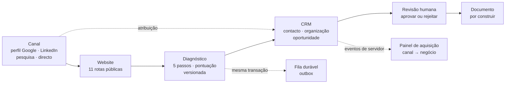
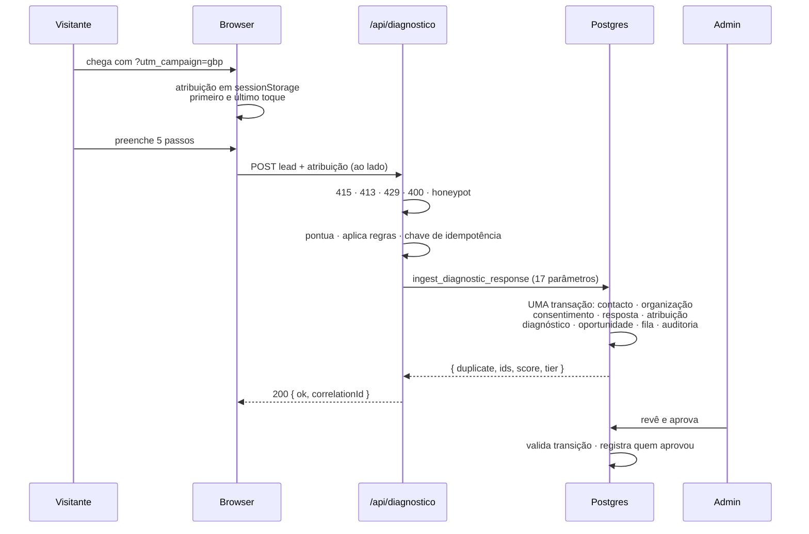

# AGORAMOZ — o website de ponta a ponta

Referência completa do sistema: o que existe, onde vive, como se liga e o que
ainda falta. Escrito a 2026-09-27, contra o commit `dae6a18`.

**Todos os números aqui foram contados no código, não estimados.** Onde há
incerteza, está escrito que há.

---

## 1. O que isto é

Não é um website com um formulário. É um sistema de aquisição em quatro camadas
que se atravessam numa transação:



A propriedade que define o sistema: **uma submissão válida grava tudo ou não
grava nada**. Contacto, organização, consentimento, resposta, diagnóstico,
oportunidade, atribuição e a intenção de processar entram na mesma transação do
Postgres. Não existe estado intermédio em que um lead foi aceite e perdido.

### Em números

| | |
|---|---|
| Ficheiros versionados | 262 |
| Rotas públicas · admin · API | 11 · 13 · 3 |
| Tabelas · vistas · tipos enum | 21 · 1 · 4 |
| Funções · gatilhos · políticas RLS | 30 · 16 · 25 |
| Componentes React | 54 |
| Variáveis de design (CSS) | 98 |
| Migrações | 10 |
| Testes automatizados | **455**, em 25 ficheiros |
| Scripts de QA | 52 — 49 em Node, 3 em shell |

### Linhas por camada

| Camada | Linhas | Ficheiros | O que é |
|---|---|---|---|
| `lib/` | 6 985 | 66 | Lógica pura: diagnóstico, atribuição, SEO, auth, base |
| `app/` | 6 116 | 45 | Rotas, páginas, API |
| `components/` | 4 677 | 54 | Interface |
| `supabase/` | 3 156 | 11 | Esquema e migrações |
| `.qa/` | 2 174 | 52 | Arnês de verificação |
| `content/` | 1 833 | 13 | Conteúdo editorial tipado |
| `docs/` | 894 | 7 | Decisões, lacunas, ameaças |

A camada maior é `lib/`, e é deliberado: a lógica que decide coisas vive fora
da interface, em funções puras que se testam sem browser.

---

## 2. Mapa de rotas

### Públicas — 11

| Rota | O que é | Dados estruturados | Imagem de partilha |
|---|---|---|---|
| `/` | Página inicial, 24 secções | Organization · WebSite · FAQPage | própria |
| `/perfil` | Destino do perfil do Google | WebPage · Breadcrumb · FAQPage | **própria** |
| `/diagnostico` | Formulário de 5 passos | WebPage · Breadcrumb · FAQPage | **própria** |
| `/solucoes` | Índice das cinco capacidades | WebPage · Breadcrumb | raiz |
| `/solucoes/[solucao]` | 5 páginas de solução | + Service · FAQPage | **própria, por solução** |
| `/[pais]` | 3 hubs de mercado: `/mz` `/pt` `/br` | WebPage · Breadcrumb | **própria, por país** |
| `/[pais]/[setor]` | Página sectorial (1 publicada) | + Service · FAQPage | raiz |
| `/como-trabalhamos` | Metodologia, 6 passos | WebPage · Breadcrumb | raiz |
| `/sobre` | Quem somos, fundadores | WebPage · Breadcrumb | raiz |
| `/contactos` | Canais | WebPage · Breadcrumb | raiz |
| `/privacidade` | Política de dados | WebPage · Breadcrumb | raiz |

### Administrativas — 13

Todas atrás de sessão. Sem sessão devolvem **404**, não 401 — quem sonda não
aprende que a área existe.

| Rota | O que faz |
|---|---|
| `/admin/entrar` | E-mail e palavra-passe. A única alcançável sem sessão |
| `/admin` | Painel: contagens e o que exige atenção |
| `/admin/diagnosticos` · `/[id]` | Lista e revisão. Aprovar ou rejeitar |
| `/admin/oportunidades` · `/[id]` | Pipeline, com filtro por **canal** e **campanha** |
| `/admin/contactos` · `/[id]` | Pessoas, com histórico e consentimentos |
| `/admin/organizacoes` · `/[id]` | Empresas, agrupadas por domínio |
| `/admin/aquisicao` | Funil por canal: vistas → diagnósticos → negócios |
| `/admin/fila` | Outbox: o que espera, o que falhou |
| `/admin/equipa` | Perfis e papéis |

### API — 3

| Rota | Método | O que faz |
|---|---|---|
| `/api/diagnostico` | POST | Ingestão. 6 guardas antes de tocar na base |
| `/api/eventos` | POST | Eventos analíticos. Responde `204` a tudo depois do parse |
| `/api/csp-report` | POST | Violações da política de segurança de conteúdo |

### Especiais

`sitemap.xml` (17 URLs) · `robots.txt` · `icon.svg` · `opengraph-image` ·
`not-found` · `global-error` · `/nao-encontrado`

---

## 3. Camada de conteúdo

O conteúdo é **tipado**, e o tipo impõe integridade. Isto é o ponto mais
invulgar do sistema e vale explicar.

`content/types.ts` torna **irrepresentável** o que não se quer publicar:

| Regra | Como é imposta |
|---|---|
| Sem clientes inventados | `ProofItem` é uma união fechada. Não existe variante que aceite um nome de cliente em texto livre |
| Sem depoimentos | idem |
| Sem números sem fonte | `SourcedStat` exige `source: { name, url }`. Um número sem fonte não compila |
| Demonstrações identificadas | `conceptual-demo` exige `disclaimer: typeof DEMO_DISCLAIMER` — um literal. Publicar sem o aviso não compila |
| Certificação sem emissor | `Certification` exige `issuer` |
| Um CTA primário só | `CTA_PRIMARY` é um tipo literal. Escrever «saiba mais» não compila |
| Sem palavras-chave no nome | `BRAND_NAME` é o literal `'AGORAMOZ'` |
| Sem urgência artificial | Não existe campo para contagem decrescente ou escassez |

### O que é editável, e onde

| Ficheiro | Conteúdo |
|---|---|
| `content/site.ts` | Identidade, navegação, oferta, processo, prova, fundadores, FAQ |
| `content/countries/{mz,pt,br}.ts` | 3 mercados: posicionamento próprio, moeda nativa, regime de privacidade, texto de consentimento |
| `content/solutions/*.ts` | 5 soluções completas |
| `content/sectors/mz/energia-mineracao.ts` | 1 página sectorial publicada, de **12 slugs possíveis** |
| `content/landing/perfil.ts` | A página de destino do perfil do Google |
| `content/registry.ts` | O registry: uma vertical nova entra aqui e aparece no sitemap sozinha |

**Cada mercado tem de declarar o seu próprio ângulo.** `CountryVoice` exige
`emphasis` e `proofLanguage` — o tipo impede tradução mecânica de um mercado
para outro. Moçambique enfatiza *proximidade, WhatsApp e telefone, execução no
terreno*; as faixas de investimento estão em MZN, nunca convertidas.

Os 11 setores sem página não desaparecem: `getSectorsForCountry()` encaminha-os
para `/diagnostico?pais=…&setor=…`.

---

## 4. Design

98 variáveis CSS em `app/globals.css`, e um teste (`lib/design/tokens.test.ts`)
que falha se alguma for usada sem estar declarada — nasceu de um defeito real
em que a ligação «saltar para o conteúdo» ficou branca sobre transparente,
invisível exactamente para quem usa teclado.

### 54 componentes

| Pasta | N.º | O que faz |
|---|---|---|
| `ui/` | 14 | Primitivos: Section, Button, Accordion, ChipGroup, ContourField |
| `motion/` | 10 | GSAP, Lenis, cursor, transições, `ChromeBlob` em WebGL2 sem biblioteca |
| `sections/` | 9 | Blocos de página reutilizáveis |
| `layout/` | 8 | Cabeçalho, rodapé, trilho, barra móvel |
| `analytics/` | 3 | Atribuição, cliques de saída, vistas |
| `home/` · `admin/` · `brand/` · `form/` | 9 | Hero, primitivos de admin, logótipo, formulário |
| `seo/` | 1 | O único renderizador de JSON-LD |

Todo o movimento respeita `prefers-reduced-motion`, e existe um interruptor
manual. Sem JavaScript, **o conteúdo aparece** — verificado em seis páginas.

### As únicas fotografias do site

`public/equipa/` tem os dois retratos dos fundadores, e são as **únicas**
fotografias em todo o `agoramoz.com`. Aparecem na secção «Quem lidera», que é o
mesmo componente em três páginas: `/`, `/perfil` e `/sobre`.

| Decisão | Porquê |
|---|---|
| Fundo recortado, mestre em **PNG** com alfa | Com mestre em WebP, o `next/image` devolvia **JPEG** a quem não anuncia `avif`/`webp`, e o JPEG achata o alfa **a preto** — o retrato dentro de um quadrado preto. Medido: `Accept: */*` dava `image/jpeg`, canto `(0,0,0)`. Com mestre PNG dá `image/png` com transparência. Os modernos continuam a receber AVIF (~30 KB) |
| Monocromia com níveis emparelhados | As duas fotografias vêm de contextos diferentes (B-17). A gama sai da **mediana do rosto**, não do sujeito: os dois vestem preto, o preto dominava a mediana, e emparelhar por aí lavava ambas |
| Moldura quadrada, rosto a 43% da largura, olhos a 46% da altura | É o alinhamento que faz dois retratos diferentes lerem como um par — e o único formato que as duas fontes preenchem até à margem inferior |
| Chapa activa em `--color-signal-700` **fixo** | O token semântico `--signal` muda com a superfície (`#ff3b10` em escuro) e a secção vive em três páginas. Giz sobre `#b82200` dá **5,48:1** — AA, calculado. Sobre `#ff3b10` daria 2,6:1 |
| Chapa opaca só nos 54% de baixo | O retrato atravessa-a no topo. O corte é geométrico: o texto vive nos 40% inferiores mesmo no cartão mais estreito, logo nenhum brilho da pele pode chegar-lhe. Com o retrato a 14% por baixo do texto, o contraste cairia a 4,40:1 e reprovaria |
| Revelação em CSS, não em GSAP | A verificação sem JavaScript carrega estas páginas; um estado dependente do GSAP deixaria a biografia inalcançável |
| Sobreposição só em `(hover: hover) and (pointer: fine)` | Em toque, retrato e texto ficam empilhados e ambos visíveis. `:focus-within` dá ao teclado o que o rato tem |
| Sem `priority` | A secção está abaixo da dobra nas três páginas. Confirmado: o elemento de LCP é um `<p>` em todas, e as imagens saem com `loading="lazy"` |

Acrescentar um fundador sem retrato **não compila**: `Founders.tsx` detém um
`Record` sobre os literais de `photo` em `content/site.ts`, e a falta de uma
chave é `TS2741`.

---

## 5. O percurso de um lead

É o caminho crítico do sistema. Cada passo aqui é código real.



### Os 5 passos

1. **Onde opera** — país, setor
2. **A empresa** — nome, dimensão, website
3. **O processo a melhorar** — processos, impacto (mín. 20 caracteres)
4. **A decisão** — prazo, faixa de investimento, papel na decisão
5. **Como o contactamos** — nome, e-mail, telefone, consentimento

O rascunho sobrevive a um recarregamento em `sessionStorage`, mas **só o
enquadramento** — país, setor, dimensão, processos, prazo, papel. Nunca nome,
e-mail, telefone ou o texto livre. Nada que identifique uma pessoa fica no
dispositivo.

### As 6 guardas da rota, por ordem

| # | Verifica | Recusa com |
|---|---|---|
| 1 | Tipo de conteúdo é JSON | 415 |
| 2 | Tamanho declarado ≤ 32 KiB | 413 |
| 3 | Limite de taxa por origem | 429 + `Retry-After` |
| 4 | Tamanho real | 413 |
| 5 | JSON válido | 400 |
| 6 | Schema Zod | 400, **sem dizer que campo** |
| — | Armadilha preenchida | **202**, indistinguível de sucesso |

A armadilha devolve sucesso de propósito: um bot que receba erro aprende qual é
o campo que o denuncia.

### Pontuação

Determinística, pura, sem rede — o mesmo resultado em cada execução, que é o
que torna um diagnóstico reproduzível. Pesa dimensão, prazo, papel na decisão,
faixa de investimento, extensão do impacto descrito, amplitude e maturidade.

| Pontuação | Classificação | Leitura |
|---|---|---|
| ≥ 70 | **A** | Prioridade máxima |
| ≥ 50 | **B** | Prioridade alta |
| ≥ 30 | **C** | Acompanhar |
| < 30 | **D** | Baixa prioridade |

A versão das regras (`2026-09-24.1`) é gravada com cada diagnóstico. Sem isso,
mudar um peso reescrevia retroactivamente o sentido de todos os diagnósticos já
emitidos, e ninguém saberia porquê.

**O `tier` nunca chega ao browser.** Era devolvido e publicado em
`window.dataLayer`, onde qualquer visitante o via em devtools — a ser
classificado e a ver a classificação. Vive só no servidor.

### Idempotência

A chave é `sha256(e-mail normalizado | versão do questionário | impressão
digital das respostas)`. A função sai **antes de escrever** se já a conhecer.

Duas submissões idênticas produzem exactamente um contacto, uma organização,
uma resposta, um diagnóstico, uma oportunidade e um evento de fila. Provado
contra Postgres real.

A atribuição fica **fora** da impressão digital de propósito: se contasse, a
mesma pessoa vinda de duas campanhas criava dois leads, e o comercial ligava
duas vezes à mesma pessoa.

---

## 6. Modelo de dados

21 tabelas, **RLS ligada em todas**, 25 políticas. `anon` não tem política
nenhuma em lado nenhum.

### CRM

| Tabela | Chave | Nota |
|---|---|---|
| `organisations` | domínio normalizado, único | Só se cria com domínio de correio empresarial |
| `contacts` | e-mail normalizado, único | Upsert. Nunca desassocia de uma organização já conhecida |
| `consent_records` | — | **Imutável.** Guarda o texto exacto que a pessoa leu, não um resumo |
| `deals` | 1 por resposta, no máximo | Canal e campanha projectados e **imutáveis** |
| `activities` | — | Notas e histórico |

`public_email_domains` — 28 domínios de correio pessoal. `gmail.com` não se
torna uma empresa com dezenas de contactos sem relação entre si.

### Diagnóstico

| Tabela | Nota |
|---|---|
| `questionnaires` · `questionnaire_versions` | Versões publicadas são **imutáveis**. Uma resposta fica presa à forma exacta do formulário que a produziu |
| `responses` | `raw` e a impressão digital são **imutáveis** após inserção |
| `response_answers` | Uma linha por pergunta, para agregar sem desmontar JSON |
| `response_attribution` | 1:1 com a resposta. Origem saneada |
| `diagnostics` | Máquina de estados, 15 estados |
| `diagnostic_drafts` | Texto redigido, antes da revisão |
| `documents` | Endereçados por **hash** de token, com expiração e revogação |

### Fila e auditoria

| Tabela | Nota |
|---|---|
| `outbox_events` | Intenção durável. Escrita na mesma transação — é isto que impede a perda silenciosa |
| `outbox_attempts` | Cada tentativa, com o erro |
| `dead_letters` | O que desistiu |
| `processed_events` | Idempotência do consumidor |
| `audit_log` | **Append-only.** Um gatilho recusa UPDATE e DELETE |
| `analytics_events` | Eventos de browser e de servidor |
| `profiles` | Papéis: `admin`, `comercial`, `leitura` |

### O que é imutável, e porquê

Seis gatilhos existem só para recusar escritas:

| Gatilho | Impede |
|---|---|
| `audit_log_append_only` | Reescrever a auditoria |
| `consent_records_imutavel` | Alterar o que a pessoa consentiu |
| `responses_raw_imutavel` | Alterar a resposta submetida |
| `questionnaire_versions_imutaveis` | Mudar um questionário já publicado |
| `deals_atribuicao_imutavel` | «Arrumar» a origem depois de a venda fechar |
| `documents_exigir_aprovacao` | Gerar documento de diagnóstico não aprovado |

O último é o que importa comercialmente: **nenhum documento sai sem aprovação
humana**, e não é uma regra na aplicação — é uma restrição da base.

### Máquina de estados do diagnóstico

```
computed → drafting → drafted → pending_review → approved → rendering
                                      ↓                        ↓
                                  rejected                   ready → sending → sent
         draft_failed   validation_failed   render_failed   send_failed   revoked
```

15 estados. As transições são validadas **em dois lugares** —
`lib/diagnostic/transitions.ts` e um gatilho. A duplicação é deliberada: a
segunda camada sobrevive a um chamador novo que não passe pela aplicação.

### Fases da oportunidade

`novo` → `qualificacao` → `proposta` → `negociacao` → `ganho` | `perdido`

---

## 7. Atribuição

De onde veio cada lead, e o que aconteceu depois.

### O que se guarda

`utm_source` · `utm_medium` · `utm_campaign` · `utm_content` · `landing_page` ·
`referrer` · `first_touch_at` · `last_touch_at` · canal derivado

### O que NÃO se guarda, e porquê

| Nunca | Razão |
|---|---|
| A query string da página de entrada | É onde a informação pessoal aterra |
| O URL completo do referenciador | Pode transportar o termo pesquisado, um identificador de sessão, um e-mail |
| Qualquer caminho sob `/documento`, `/admin`, `/api` | Um documento é endereçado por token, e o token viaja no caminho |
| Identificador de visitante | Sem cookie, sem `visitor_id`. A junção ao CRM é por **canal** |

### O sanitizador

Lista de **permissão**: `^[a-z0-9._-]{1,64}$`. O que não passa é **recusado**,
nunca truncado nem limpo.

Truncar produziria um valor diferente com aparência legítima — uma campanha
cortada aos 64 caracteres aparece no relatório como real e agrupa-se com outra
que partilhe o prefixo. Limpar-e-guardar devolve um valor que ninguém enviou.

A propriedade que os testes fixam: **o que sai é o que entrou em minúsculas, ou
é nulo. Nunca outra coisa.**

A mesma regra é repetida em SQL (`utm_limpo`) e em `CHECK`. Não é desconfiança
do TypeScript: é a camada que sobrevive a um chamador novo — um script de
importação, uma correção à mão, um segundo formulário.

**Uma origem malformada nunca custa um lead.** Quem preencheu cinco passos quer
falar; perder isso por um UTM esquisito seria trocar o valioso pelo acessório.

### Os canais

`gbp` · `organico` · `social` · `referencia` · `campanha` · `directo` ·
`desconhecido`

`gbp` merece nota: o Google envia o **mesmo referenciador** quer a visita venha
do perfil de empresa quer da pesquisa normal. A etiqueta `utm_campaign=gbp` no
URL do perfil é a única coisa que os distingue.

`desconhecido` é o número a vigiar: mede quanta atribuição se está a perder.

---

## 8. Analítica

Primeira parte, na própria base. Não GA4, e por três razões concretas:

- o CSP tem `connect-src 'self'` e nenhum terceiro em `script-src`;
- `/privacidade` promete por escrito que a medição «é agregada e não identifica
  visitantes individualmente»;
- e a decisiva: o painel pedido liga perfil, website, diagnóstico e CRM. Isso é
  uma **junção**, e uma junção precisa dos dois lados na mesma base. O GA4
  nunca saberia se o negócio fechou.

### Eventos

| Do browser | Do servidor |
|---|---|
| `gbp_landing_view` | `deal_created` |
| `diagnostic_started` | `deal_won` |
| `form_step_completed` | `document_confirmed_view` |
| `diagnostic_submitted` | |
| `service_viewed` · `country_selected` · `sector_selected` | |
| `whatsapp_clicked` | |

Os de servidor nascem em **gatilhos da base**. Um `deal_won` que qualquer
browser pudesse enviar não serviria para medir nada — e o gatilho apanha todos
os caminhos até `ganho`, incluindo uma correção feita à mão em SQL.

`meeting_requested` está definido e **não é disparado**: este site não tem
superfície de marcação de reunião, e dispará-lo no clique de WhatsApp produziria
um número com aparência de procura que duplicava `whatsapp_clicked`.

### O painel de aquisição

`/admin/aquisicao` — por canal: vistas → diagnósticos iniciados → submissões →
oportunidades → ganhos.

As três últimas colunas vêm da base e são exactas. As duas primeiras dependem
de JavaScript no browser de quem visita e ficam subcontadas. **A diferença é
informação, não erro:** mede a parte do tráfego que não se deixa medir. O ecrã
di-lo.

---

## 9. Segurança

### Camadas

| Camada | O que faz |
|---|---|
| `middleware.ts` | `/admin` sem sessão → **404**, não 401 |
| RLS | 25 políticas. `anon` sem política em tabela nenhuma |
| Papéis | `admin` · `comercial` · `leitura`. Toda a escrita passa por `exigir_papel` |
| `security definer` | 11 funções de escrita. Nenhuma tabela é escrita directamente pelo admin |
| CSP | Sem `unsafe-eval`. Zod em modo `jitless` para dispensar `new Function` |
| Server Actions | O Next verifica `Origin` contra `Host`. Nenhum `GET` altera estado |

### CSP

```
default-src 'self'      · base-uri 'self'       · form-action 'self'
frame-ancestors 'self'  · object-src 'none'     · connect-src 'self'
img-src 'self' data: blob:                      · worker-src 'self' blob:
style-src 'self' 'unsafe-inline'                · script-src 'self' 'unsafe-inline'
upgrade-insecure-requests · report-uri /api/csp-report
```

Em modo de relatório por omissão. Passa a imposta quando as violações
reportadas forem zero — impor uma política não testada parte o site.

### Cabeçalhos

| Alcance | Cabeçalhos |
|---|---|
| Tudo | `X-Content-Type-Options` · `Referrer-Policy` · `X-Frame-Options` · `Permissions-Policy` |
| `/admin/*` | `X-Robots-Tag: noindex, nofollow, noarchive` · `Cache-Control: no-store` |
| `/documento/*` | + `Referrer-Policy: no-referrer` |

O `no-referrer` nos documentos é o que ninguém se lembra: a política global é
`strict-origin-when-cross-origin` e o token viaja no **caminho** — qualquer
ligação externa clicada a partir da página do documento entregaria o token ao
destino.

### Segredos

Nenhuma chave do Supabase tem prefixo `NEXT_PUBLIC_`. **Nunca corre um cliente
Supabase no browser.** Todo o admin é servidor; toda a mutação é Server Action.

Procurei chaves reais em todos os ficheiros versionados — `sb_secret_`, `sbp_`,
JWT, `sk-`. Nenhuma. O `.env.example` tem todos os valores comentados.

### PII

O IP e o user-agent são guardados como **SHA-256**, nunca em claro. As colunas
exigem `^[0-9a-f]{64}$` — um hash de comprimento errado é recusado pela base.

---

## 10. SEO

| Item | Estado |
|---|---|
| Títulos e descrições únicos | Verificado por teste em todas as rotas |
| Canonical | Absoluto, em todas as páginas |
| hreflang | Recíproco, nos três mercados. Só onde as páginas existem |
| Imagem de partilha | Presente em todas. **Própria** em 11 rotas, de 5 ficheiros |
| Sitemap | 17 URLs, derivado do registry |
| `robots.txt` | `Disallow: /api/` e `/admin/`. Previews nunca indexados |
| Trilho de navegação | Visível **e** estruturado, do mesmo array |
| Dados estruturados | Grafo ligado por `@id` |
| `LocalBusiness` | **Inelegível por construção** — ver abaixo |

### O grafo `@id`

Antes, cada componente emitia um `<script>` isolado. Numa página de solução, a
consequência era a página declarar **duas organizações**: a completa e uma
segunda, magra, que o `Service` inventava como `provider`. Duas entidades a
descrever a mesma empresa, na mesma página.

Agora tudo aponta a `#organization`. É assim que os motores de busca resolvem
«que empresa é esta» — e é a base da correspondência entre o perfil do Google e
o website.

### `LocalBusiness`: inelegível, provado pelo compilador

A AGORAMOZ é uma empresa de **área de serviço**: presta serviço em Moçambique,
Portugal e Brasil e não tem morada pública de atendimento.

`localBusinessNode` não aceita `Identity` — aceita apenas factos já estreitados
para `'confirmed'`. Uma tentativa de o chamar com os factos de hoje produz
**três erros `TS2322`**, um por facto em falta. «Apenas se elegível» não é um
comentário nem um `if` que alguém possa apagar.

E porque o tipo deixa de proteger no instante em que alguém escrever
`status: 'confirmed'`, há uma segunda rede que recusa:

- vocabulário de rascunho (`exemplo`, `TODO`, `teste`…)
- código postal com a forma de outro país
- coordenadas em `0,0`, fora do país, ou no **centróide** do país — o que um
  geocodificador devolve quando só recebe o nome do país
- coordenadas com menos de três casas decimais
- horário de sete dias das 00:00 às 23:59 — o valor por omissão de um formulário
- factos sem quem os confirmou e quando
- e, literalmente, `Avellino Way` — o endereço de exemplo do LinkedIn

Um facto recusado **degrada** para inelegível em vez de levantar erro: publicar
uma morada inventada é pior do que não publicar morada nenhuma, e rebentar em
produção é pior do que ambos.

---

## 11. Verificação

### 455 testes, em CI

| Domínio | O que guarda |
|---|---|
| Diagnóstico | Regras, pontuação, transições, validação de rascunho, normalização |
| Atribuição | Sanitizador com entradas hostis, canal, captura, primeiro/último toque |
| SEO | Identidade, inelegibilidade, grafo `@id`, unicidade, imagens, trilho |
| Contratos | Parâmetros da RPC lidos **do próprio SQL** por regex |
| Migrações | Nenhuma função `language sql` lê tabela criada depois |
| Rota | 45 testes: guardas, idempotência, o que é e não é gravado |
| Formulário | Cobertura do schema, mensagens em português sem fuga de identificadores |

O padrão que atravessa tudo: **cada guarda foi provado a falhar com o defeito
reintroduzido.** Um teste que nunca falhou não é um guarda.

E vários testes verificam-se a si próprios — um teste que lê a fonte e não
encontra nada passa por vazio, que é o modo de falha mais perigoso.

### Medido contra o build real

| Verificação | Resultado |
|---|---|
| Sem JavaScript, 6 páginas | H1 visível, 200, trilho presente |
| axe (`wcag2a+2aa+21a+21aa`) | **zero violações** em `/`, `/perfil`, `/diagnostico` |
| Móvel 390px | zero scroll horizontal |
| Alvos táteis, WCAG 2.2 AA | zero abaixo de 24×24 |
| LCP móvel, CPU 4× | `/perfil` **356 ms** · `/` 1272 ms |

Estes números não são dados de campo: contentor, throttling sintético, sem rede
lenta. Servem para comparar rotas e apanhar regressões. O número que conta para
os Core Web Vitals vem do CrUX, depois de haver tráfego.

---

## 12. Infraestrutura

| Camada | O que é |
|---|---|
| Framework | Next 16.3.5, App Router · React 19.2 · TypeScript 5.9.3 |
| Estilo | Tailwind 4.3.3, tokens em CSS |
| Validação | Zod 4.1.13, em modo `jitless` |
| Movimento | GSAP 3.15 · Lenis · WebGL2 sem biblioteca |
| Base | Supabase Postgres 17.6, projecto `nixltrbdplqjadfytryd` |
| Alojamento | Vercel, funções em `fra1` |
| Testes | Vitest 3.2.7 · Playwright · axe |
| Gestor | pnpm |

### Comandos

```bash
pnpm dev         # desenvolvimento
pnpm build       # build de produção
pnpm test        # 455 testes
pnpm typecheck   # tsc --noEmit
pnpm lint        # eslint
node .qa/seo-qa.mjs   # sem-JS, axe, móvel (requer next start)
```

### Variáveis de ambiente

16 no schema, todas validadas no arranque — uma em falta falha cedo, não em
produção. As que decidem comportamento:

| Variável | Efeito |
|---|---|
| `DIAGNOSTIC_PERSISTENCE` | `required` grava e devolve 503 se falhar. `off` valida e **não** grava |
| `ANALYTICS_PERSISTENCE` | `on` grava eventos. `off` responde e não toca na base |
| `CSP_REPORT_ONLY` | `false` impõe a política |

As duas primeiras são explícitas e não inferidas da presença das chaves: um
sistema que se liga sozinho por inferência é um sistema que ninguém decidiu
ligar.

---

## 13. Estado actual

### No ar, verificado em `agoramoz.com`

Commit `3133080`. Títulos sem marca duplicada, `og:image` e `twitter:image`
presentes, `Disallow: /admin/` no robots.

### Pronto, à espera da base

Cinco lotes committados (`251405d` → `dae6a18`). **Não publicáveis** até a
`0009` e a `0010` correrem: a `0009` larga a função de ingestão de 16 argumentos
e recria-a com 17, e o site que está no ar chama a de 16.

O ficheiro a correr é `supabase/aplicar-0009-0010.sql`, com verificações no fim.
O procedimento está em `docs/SEO_ACTIVACAO.md`.

### Lacunas factuais registadas

Em `docs/GAPS.md`, com a consequência de cada uma. **Nenhuma foi resolvida por
invenção.**

| # | Falta |
|---|---|
| B-02 | Plano do Supabase por confirmar — se for gratuito, uma pausa é 503 para toda a gente |
| B-03 · B-04 | Autenticação do consumidor n8n, sem lhe dar a chave de serviço; sem fornecedor de IA |
| B-06 | Publicação automática parada — cada push precisa de deployment manual |
| B-08 | Sem morada, coordenadas nem horário — provavelmente correcto para área de serviço |
| B-09 | Sem Search Console nem Analytics |
| B-10 | O LinkedIn lista `Avellino Way, Mountain View, California` como segunda localização |
| B-11 | Sem nome legal registado, NUIT, data de fundação |
| B-12 | Sem clientes, depoimentos ou métricas citáveis |
| B-13 | Sem rota de documentos — `document_confirmed_view` sem emissor |
| B-15 | Primeiro toque entre sessões por decidir — exige edição de `/privacidade` |
| B-16 | Sem superfície de marcação de reunião |

### O que não afirmo

- **Não declaro conformidade legal.** Os dados ficam na UE e o consentimento é
  capturado com o texto exacto, mas não houve revisão qualificada. O regime
  moçambicano aplicável a leads locais não foi verificado em fonte primária.
- **Não declaro Core Web Vitals.** Os números de LCP são locais e sintéticos.
- **Não declaro que o perfil do Google existe.** Não tenho acesso para o
  confirmar.

---

## 14. Estrutura de pastas

```
agoramoz/
├── app/                        rotas e API — 45 ficheiros, 6 116 linhas
│   ├── (site)/                 as 11 rotas públicas
│   │   ├── page.tsx            inicial, 24 secções
│   │   ├── perfil/             destino do perfil do Google + imagem própria
│   │   ├── diagnostico/        formulário de 5 passos + imagem própria
│   │   ├── solucoes/           índice + [solucao] com 5 páginas
│   │   ├── [pais]/             3 hubs + [setor]
│   │   ├── como-trabalhamos/  sobre/  contactos/  privacidade/
│   │   ├── layout.tsx          o SiteChrome
│   │   └── error.tsx           fronteira de erro do site
│   ├── admin/                  13 ecrãs
│   │   ├── entrar/             o único alcançável sem sessão
│   │   └── (painel)/           painel · diagnósticos · oportunidades
│   │                           contactos · organizações · aquisição
│   │                           fila · equipa
│   ├── api/
│   │   ├── diagnostico/        ingestão, 6 guardas
│   │   ├── eventos/            analítica de primeira parte
│   │   └── csp-report/         violações de CSP
│   ├── layout.tsx              html, body, fontes, metadataBase
│   ├── robots.ts  sitemap.ts   17 URLs, derivados do registry
│   ├── opengraph-image.tsx     cartão de partilha da raiz
│   ├── icon.svg
│   ├── not-found.tsx  global-error.tsx  nao-encontrado/
│   └── globals.css             98 variáveis de design
│
├── components/                 54 componentes
│   ├── ui/          (14)       Section · Button · Accordion · ChipGroup
│   │                           ContourField · ChromeText · DitherMark
│   ├── motion/      (10)       GSAP · Lenis · cursor · PageTransition
│   │                           ChromeBlob em WebGL2 sem biblioteca
│   ├── sections/     (9)       blocos reutilizáveis de página
│   ├── layout/       (8)       cabeçalho · rodapé · trilho · barra móvel
│   ├── analytics/    (3)       atribuição · cliques de saída · vistas
│   ├── home/         (3)       hero · selector · diagrama de fluxo
│   ├── admin/        (2)       primitivos e navegação
│   ├── form/         (2)       o formulário e o campo
│   ├── brand/        (2)       logótipo e marca
│   └── seo/          (1)       o único renderizador de JSON-LD
│
├── content/                    conteúdo tipado — 13 ficheiros, 1 833 linhas
│   ├── types.ts                os contratos de integridade
│   ├── site.ts                 identidade · navegação · oferta · prova
│   ├── registry.ts             o registry, fonte única de rotas
│   ├── countries/              mz · pt · br
│   ├── solutions/              5 soluções
│   ├── sectors/mz/             1 de 12 setores publicado
│   └── landing/perfil.ts
│
├── lib/                        lógica pura — 66 ficheiros, 6 985 linhas
│   ├── diagnostic/             regras · pontuação · transições · evidência
│   ├── attribution/            sanitizador · canal · captura · storage
│   ├── analytics/              eventos · schema · track
│   ├── seo/                    metadata · og · schema/ (grafo @id)
│   ├── admin/                  acções · rótulos · RPC · paginação
│   ├── auth/                   cliente · sessão · acções
│   ├── db/                     cliente de servidor e contrato da RPC
│   ├── forms/                  schema do lead · pontuação
│   ├── http/                   limite de taxa
│   ├── log/                    registo estruturado com allowlist
│   ├── motion/  design/  utils/  webgl/
│   └── config/env.ts           16 variáveis validadas no arranque
│
├── supabase/
│   ├── migrations/             0001 → 0010
│   │   ├── 0001_foundation     papéis · RLS · auditoria
│   │   ├── 0002_crm            organizações · contactos · consentimento
│   │   ├── 0003_questionnaires diagnósticos · documentos · oportunidades
│   │   ├── 0004_outbox         fila durável
│   │   ├── 0005_ingest         a transação de ingestão
│   │   ├── 0006_admin_actions  11 funções security definer
│   │   ├── 0007_endurecer      search_path e superfície REST
│   │   ├── 0008_seed           o questionário público
│   │   ├── 0009_atribuicao     origem + a função com 17 parâmetros
│   │   └── 0010_eventos        eventos + o funil de aquisição
│   └── aplicar-0009-0010.sql   para correr no SQL Editor
│
├── docs/                       7 documentos, 894 linhas
│   ├── ARQUITETURA.md          este
│   ├── DECISIONS.md  GAPS.md  THREAT_MODEL.md  DATA_FLOW.md
│   └── SEO_ACTIVACAO.md  CURRENT_STATE.md  CHANGE_PLAN.md
│
├── .qa/                        52 scripts de verificação
│   ├── seo-qa.mjs              sem-JS · axe · móvel · alvos táteis
│   ├── lcp-rota.mjs            LCP por rota e viewport
│   └── links · shots · cls · perf · contrast · csp · kbd · …
│
├── public/
│   ├── brand/                  2 logótipos, 2000×2000
│   └── equipa/                 2 retratos recortados, 1280×1280 com alfa
│
├── .claude/settings.json       marketplace e plugin ECC, âmbito projecto
├── middleware.ts               a guarda do /admin
├── next.config.ts              CSP e cabeçalhos
├── vitest.config.ts            455 testes, ambiente Node
└── package.json                Next 16.3.5 · React 19.2 · TS 5.9.3
```

### Onde mexer, para a tarefa que for

| Quero… | Vou a… |
|---|---|
| Mudar texto de uma solução | `content/solutions/<slug>.ts` |
| Acrescentar um mercado | `content/countries/` + `registry.ts` |
| Publicar um setor novo | `content/sectors/<pais>/<setor>.ts` + `registry.ts` |
| Mudar a identidade da empresa | `content/site.ts` (`SITE` e `IDENTITY`) |
| Mudar cores ou tipografia | `app/globals.css` |
| Mudar a pontuação do lead | `lib/forms/lead-score.ts` **e subir `SCORING_VERSION`** |
| Acrescentar um campo ao formulário | `lib/forms/lead-schema.ts` + `STEP_FIELDS` |
| Acrescentar um evento analítico | `lib/analytics/events.ts` + `event-schema.ts` |
| Mudar o esquema da base | migração nova em `supabase/migrations/` |

---

## 15. Documentos irmãos

| Ficheiro | O que contém |
|---|---|
| `docs/DECISIONS.md` | Cada decisão de desenho e a razão |
| `docs/GAPS.md` | Lacunas, divergências e o que bloqueia cada uma |
| `docs/THREAT_MODEL.md` | Ameaças identificadas e a mitigação de cada |
| `docs/DATA_FLOW.md` | O percurso dos dados, campo a campo |
| `docs/SEO_ACTIVACAO.md` | Perfil do Google e Search Console, passo a passo |
| `docs/CURRENT_STATE.md` | Estado herdado à entrada deste trabalho |
| `docs/CHANGE_PLAN.md` | O plano por lotes |
